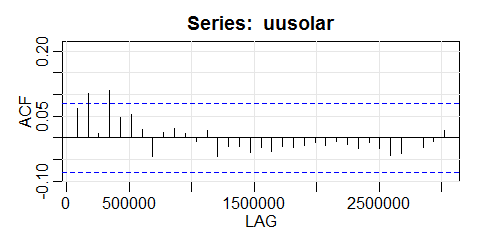
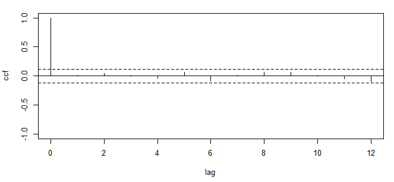

11.	Brevemente explique los siguientes términos: 

+ **Estacionariedad:**

El comportamiento de una serie de tiempo, su forma, sus movimientos y su apariencia visual dependen de la distribución de probabilidad que gobierna el mecanismo de generación de datos, o procesos estocástico, que la produce. 

A su vez, dichas características probabilísticas pueden cambiar o no en el tiempo. Si cambian en el tiempo será mucho más difícil modelar y más riesgoso hacer inferencias y predicciones con base a la información provista por los datos de la serie de tiempo disponible. 

Pero si esta condición no cambiar se conoce como estacionariedad, será más fácil modelar y hacer predicciones porque podremos confiar en la estabilidad de la especificación y de los parámetros estimados, aun por fuera de la muestra. Es decir si fu función acumulativa es independiente del tiempo.

+ **Ruido blanco:**

Es la serie estocástica más aleatoria, es decir es un proceso independiente e idénticamente distibuido (iid), es ruido blanco si:

$$x_i \sim iid(\mu,\sigma^2)$$

Donde usualmente $\mu = 0$, el ruido blanco no tiene que ser simetrico. Un ejemplo de ruido blanco es el lanzamiento de un dado, pues cada lanzamiento es independiente y la probabilidad no cambia, es decir que no es pronosticable por su propio pasado.

+ **Correlograma:** 

Conocido también como gráfico de autocorrelación, es una herramienta que permite ver la correlación de estadisticas,  de la muestra $r_h$ vs. $h$ en el tiempo. Un ejemplo de ello se puede ver a continuación.

```{r echo=FALSE, out.width='100%'}

```

+ **Función impulso respuesta:** 

La respuesta al impulso en un "golpe" instantáneo o impulso a un sistema, al dar un choque unitario a uno de los $m$ errores del vector $\varepsilon_t$. Permitiendo estudiar la estabilidad de un sistema. Si este es estable el efecto del choque decae con el tiempo.

Si $x_t$ is una unidad impulso si en el tiempo $t=0$:

$$x_t=\begin{Bmatrix}
1, & t=0\\ 
0, & t\neq 0
\end{Bmatrix}$$
entonces su salida es;

$$y_t = \sum_{i=0}^{\infty}v_ix_{t-i}=v_t$$
+ **Proceso estocástico {x_t}:** 

Es una secuencia de variables aleatorias ordenadas por un índice t, usualmente el tiempo, se representa como:


$${x_t}=(...,x_1,x_2,x_3,...)$$


Cabe resalta que un proceso estocástico no es una serie de valores o datos ya conocidos a través del tiempo, por el contrario es como un experimento aleatorio que consiste en asignar valores a $X_t$, como por ejemplo lanzar un dado 100 veces, por cada ronda obtendremos un resultado diferente.

+ **Estadistica Q:** 

+ **Tendencia estocástica:** 

Es un componente estocástico cuya varianza tiende
a infinito con el paso  del tiempo, un ejemplo de ello es un random walk.

+ **Correlación cruzada:** 

Esta describe el grado de correlacion entre 2 series de tiempo diferentes, es usada para determinar si el cambio de una de las series puede potencialmente causar un cambio en la otra. Por ejemplo, is una acción en el tiempo $t$ tiene efecto en el GDP en el tiempo $t+2$, sigificaria que es un indicador de lag.

```{r echo=FALSE, out.width='100%'}

```

+ **Raíz unitaria:**  

Es una tendencia estocástica en la serie temporal. Algunas veces se le llama “Random walk with dirft” es decir: 

$$y_t = y_0 +\delta_1t + \sum\varepsilon_t$$
Si la serie tiene una raíz unitaria, ésta presenta un patrón sistemático que es impredecible. Es decir no es estacionario.La raíz unitaria sesga la significancia de las variables presentando un buen ajuste y puede llegar a considerarse que hay una relación entre ellas cuando en realidad no la hay.