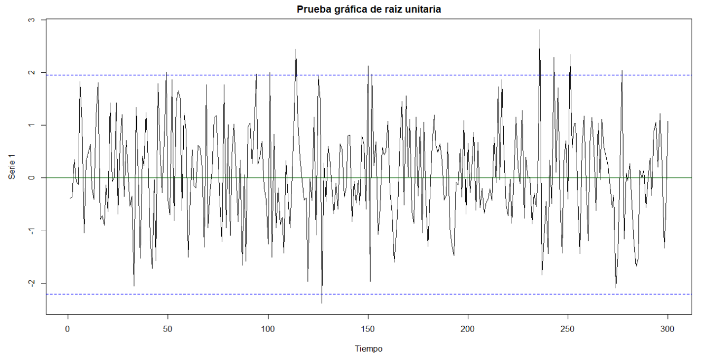

2. 	Comente otras pruebas de raíz unitaria


Las Pruebas de raíz unitaria buscan establecer si una serie es estacionaria, aunque siempre es recomendable gráficar primero para darnos una idea de su comportamiento

```{r echo=FALSE, out.width='100%'}

```

En el grafico anterior podemos ver que la media es aparentemente constante al igual que su varianza.

+ **Phillips-Perron:** Es una variante de la prueba de Dicckey-Fuller, la cual permite que los errores ut, no sean ruido blanco, esta prueba requiere una estimación del espectro del error ut, esta hace uso del test de Dickey-Fuller simple, pero el (error estándar), es ajustado por el efecto de las autocorrelaciones estimadas de ut, usando ponderación mediante kernel, para cubrir los rezagos utilizados, donde es posible incluir una constante , y una tendencia lineal.

$$\Delta y_t = \beta'D_t + y_{t-1} + u_t$$
$$u_t \sim I(0)$$
Este test no necesita de lags, debido a que este test es robusto a una correlación serial y a heterocedasticidad en los errores $u_t$, de la regresión de prueba modificando directamente los estadísticos de prueba $t_{\pi=0}$ y T por $Z_t$ y $Z_\pi$.


$Z_t = \frac{\hat{\sigma}^2}{\hat{\lambda}^2}t_{\pi=0}-\frac{1}{2}\frac{\hat{\lambda}^2 - \hat{\sigma}^2}{\hat{\lambda}^2}\frac{SE(\hat{\pi})T}{\hat{\sigma}^2}$


$$Z_\pi = T_\hat{\pi}-\frac{T^2SE(\hat{\pi})}{\hat{\sigma}^2}(\hat{\lambda}^2-\hat{\sigma}^2)$$
Los términos $\hat{\lambda}^2$ y  $\hat{\sigma}^2$son estimaciones consistentes de los parámetros de varianza.


$$\lambda^2 = \lim_{T\to \infty}T^{-1}\sum_{t=1}^{T}E[u_t^2]$$
$$\lambda^2 = \lim_{T\to \infty}\sum_{t=1}^{T}E[T^{-1}S_t^2] =LVR$$

$$S_t = \sum_{t=1}^Tu_t$$
La varianza muestral de los residuales de los  mínimos cuadrados para $\hat{u}_t$, es una estimación consistente de  $\hat{\sigma}^2$ y   la estimación de la varianza a largo plazo de Newey-West de $u_t$utilizando $\hat{u}_t$ consistente de la estimación de $\hat{\lambda}^2$.

Resultado: Bajo la hipótesis nula de que $H_0 : \pi=0$, los estadísticos $Z_t$ y  $Z_{\pi}$ para la prueba PP. tienen las mismas distribuciones asintóticas que el estadístico $t$ del ADF y el estadístico de sesgo normalizado. Aunque el 2004 Davison y Mckinnon mostraron que este test no se comporta tan bien como el Dickey-fuller en muestras finitas.

+ **Contraste Elliot , Rothenberg and Stock (ERS):**

El estudio del punto óptimo de ERS se basa en la cuasi-regresión de diferenciación que se define.

$$D(Y_t\mid a) = D(X_t\mid a)\delta (a)+\varepsilon_t $$
Definir los residuos de la ecuación como $\hat{\varepsilon}_t(a)=D(Y_t\mid a)-D(X_t\mid a)\hat{\delta} (a)$ y dejar que $SSR(a)=\sum_{t=1}^n\hat{\varepsilon}_t^2(a)$, sea la suma de los residuos al cuadrado. El ERS (posible) el punto óptimo de la estadística de prueba de la hipótesis nula que a = 1 frente a la alternativa que a = a , es definido como:

$$P_t =\frac{SSR(\bar{a})-\bar{a}SSR(1)}{f_0}$$

Donde $f_0$, es un estimador del espectro residual en la frecuencia cero. Para calcular la prueba de ERS, debe especificar el conjunto de regresores exógenos $x_t$ y un método para estimar $f_0$. Los valores críticos para la estadística de prueba ERS se calculan por interpolación de los resultados de la simulación prevista por el ERS para $T = (50,100,200,∞)$.

+ **KPSS ( Kwiatkowski–Phillips–Schmidt–Shin):** A diferencia de las pruebas ADF y PP, esta no toma la presencia de una raíz unitaria como hipótesis nula, cabe resaltar que esta prueba es de tendencia estacionaria, pues es posible que la serie temporal no sea estacionaria, no tenga raíz unitaria y , sin embargo, tenga tendencia estacionaria, es decir que la media puede crecer o disminuir en el tiempo como producto de una perturbación pero siempre convergerá a la media.

$$y_t = \beta'D_t + \mu_t + u_t, u_t \sim I(0)$$

$$u_t = u_{t-1}+\varepsilon_t,\varepsilon_t \sim WN(0,\sigma_\varepsilon^2) $$
Siendo $D_t$ el componente determinístico y el contraste de hipótesis:

$$H_o:\sigma_\varepsilon^2 = 0, y_t \sim I(0)$$
$$H_a:\sigma_\varepsilon^2 > 0, y_t \sim I(1)$$

 estadístico de prueba KPSS es el multiplicador de Lagrange (LM) o estadística de puntuación para probar $\sigma_\varepsilon^2=0$:
 
$$KPSS = \frac{T^{-2}\sum_{t=1}^T  \hat{S}_t^2}{\hat{\lambda}^2}$$

$${\hat{S}_t} = \sum_{t=1}^t\hat{u}_j$$

Donde $u_t$ es el residual de la regresión de $y_t$ sobre $D_t$, $\hat{\lambda^2}$ es una estimación consistente de la varianza a largo plazo de utusando $\hat{u}_t$
Los resultados asintóticos asumen que $H_0:y_t\sim I(0)$ es verdadero.

* Si $D_t= 1$ entonces:

$$KPSS\Rightarrow \int_{0}^{1}V_1(r)dr$$
$$V_1(r)=W(r)-rW(1)$$

* Si $D_t= (1,t)$ entonces:

$$KPSS\overset{d}{\rightarrow}\int_{0}^{1}V_2(r)dr$$

$$V_2(r) = W(r) +r(2-3r)W(1)+6r(r^2-1)\int_0^1W(s)ds$$

Nota: $V_1(r)$es llamado Brownian bridge, y satisface que  $V_1(0)=V_1(1)=0$


```{r echo=FALSE, out.width='100%'}

```

Tabla de distribución de los quantiles del estadisticos KPSS.

Los valores críticos de las distribuciones asintóticas deben obtenerse por métodos de simulación
El test de estacionariedad es un test de cola derecha  unilateral de modo que se rechaza el nulo de estacionariedad al nivel $100 - α\%$ si el estadístico de la prueba KPSS es mayor que el cuantil $100 - (1 - α)\%$ de la distribución asintótica apropiada.

+ **Prueba de NG y Perron (NP)**

NG y Perron (2001) construye cuatro pruebas estadísticas que se basan en los datos del GLS sin tendencia $Y_t^d$ . Estas pruebas estadísticas modifican las formas del estadístico Phillips y Perron $Z_a$ y  $Z_t$ , el estadístico Bhargava (1986) $R_1$  y el estadístico ERS punto óptimo. En primer lugar, definimos el término:


$$K = \frac{\sum_{t=1}^T(Y_{t=1}^d)^2}{T^2}$$

Las estadísticas modificadas pueden escribirse como:

$$MZ_a^d = \frac{T^{-1}(Y_{t=1}^d)^2-f_0}{2K}$$
$$MZ_t^d = MZ_a \times MSB$$
$$MSB =\left (\frac{K}{f_0}\right )^{0.5}$$
$$MP_T^d = \begin{Bmatrix}
\frac{\bar{c}^2k-\bar{c}T^{-1}(Y_t^d)^2}{f_0}, & X_1=(1) \\ 
\frac{\bar{c}^2k+(1-\bar{c})T^{-1}(Y_t^d)^2}{f_0}, & X_1=(1,t)
\end{Bmatrix}$$

Donde:

$$\bar{c}=\begin{Bmatrix}
-7, & X_1=(1)\\ 
 -13.5& X_1=(1,t)
\end{Bmatrix}$$

Las pruebas NP requieren una especificación para $X_t$ y la elección de un método para la estimación de $f_0$.