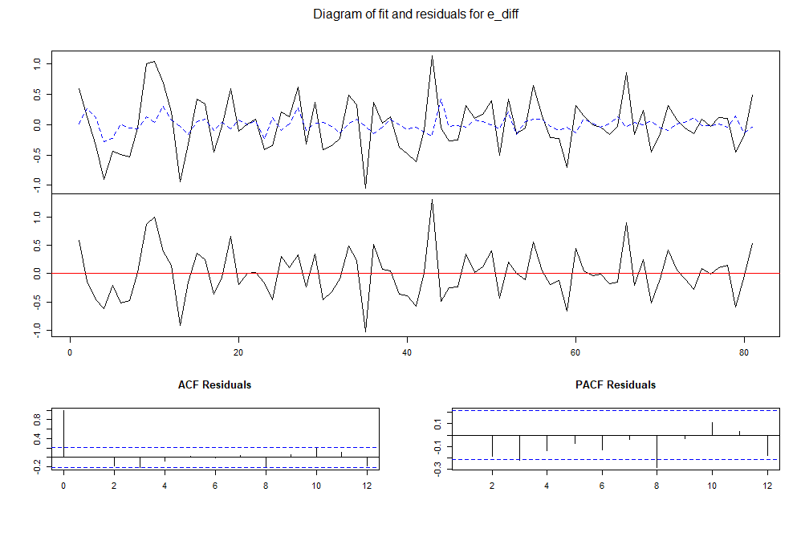
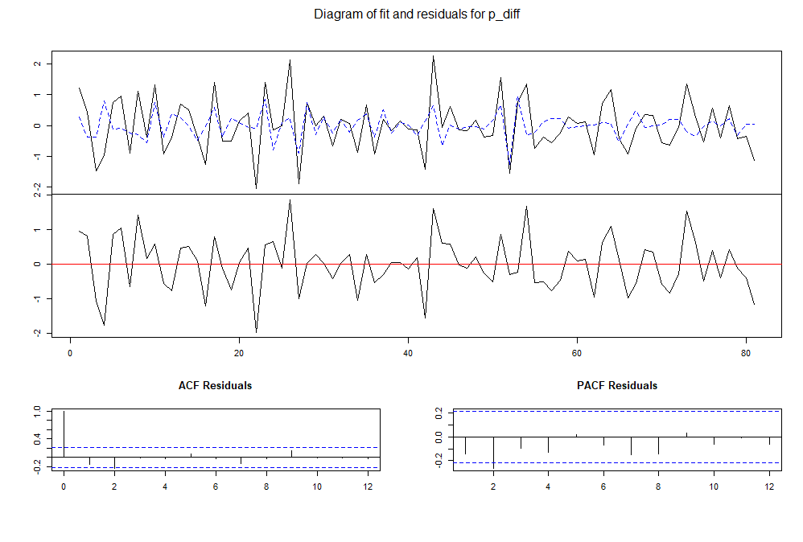
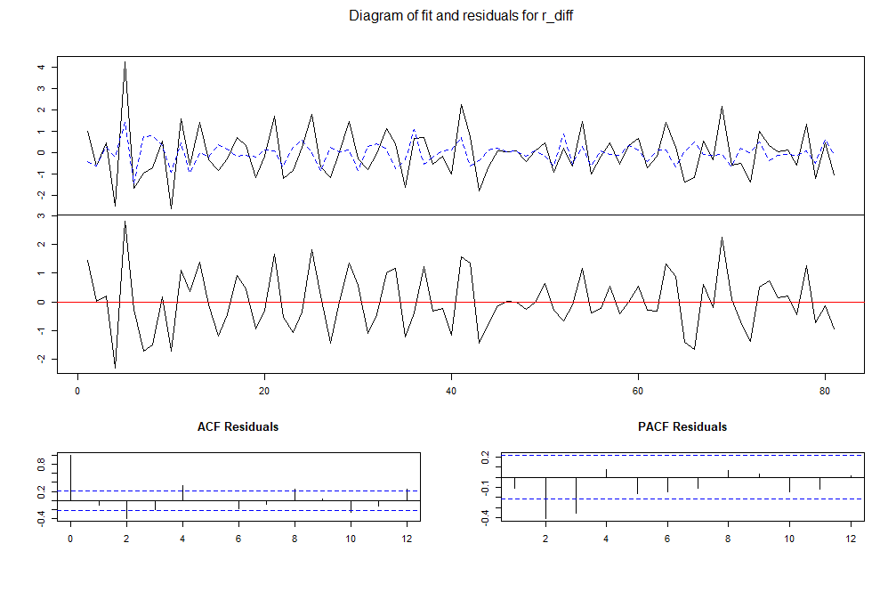
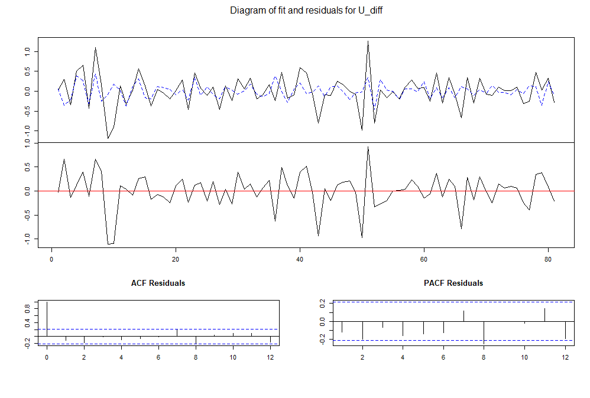

4.	Con los datos anteriores haga un análisis del modelo VAR(1) .  interprete los resultados


Lo primero es cargar las librerias

```{r}
library(tseries)
library(ppcor)
library(TSA)
library(forecast)
library(ggplot2)
library(Ecdat)
library(vars)

```


```{r}
library("vars")
data("Canada")
Canada <- as.data.frame(Canada)
attach(Canada)
```

Como resultado del ejercicio anterior se verifico que ninguna de las series es estacionaria, por lo que se aplica el comando ndiff para verificar cuantas veces se tiene que diferenciar la variable para lograr la estacionariedad.

```{r}
par(mfrow=c(2,2))
plot(e, typ= "l", col="blue",)
plot(prod, typ= "l", col="red")
plot(rw, typ= "l", col="green")
plot(U, typ= "l", col="black")

```


```{r}

n_diferenciar <- function(df){
  
  for(i in 1:ncol(df)){
    
    cat("Se debe diferencia la ST ", names(df)[i]," :", ndiffs(df[,i]), " veces.\n")
    
  }
  
}

```

```{r}
n_diferenciar(Canada)
```
Se ve que el numero máximo de veces que se debe diferenciar es 2 veces, el salario real, por lo que debemos balancear todos nuestros datos diferenciando 2 veces.

```{r}

e_diff <- diff(diff(e))
p_diff <- diff(diff(prod))
r_diff <- diff(diff(rw))
U_diff <- diff(diff(U))

```


```{r}
par(mfrow=c(2,2))
plot(e_diff, typ= "l", col="blue", ylim=c(-2,2))
plot(p_diff, typ= "l", col="red")
plot(r_diff, typ= "l", col="green")
plot(U_diff, typ= "l", col="black")

```

Luego de ellos agrupamos todas nuestras variables diferenciadas

```{r}

C_diff <-cbind(e_diff,p_diff,r_diff,U_diff)
head(C_diff)
```
Según lo solicitado se crea un modelo $Var(1)$.

```{r}
Var1 <- VAR(C_diff, p=1)
Var1
```

Se generan 4 ecuaciones una para cada una de las series donde:

+ e_diff.l1 = resago empleo
+ p_diff.l1 = Resago produccion
+ U_diff.l1 = resago desempleo
+ rw_diff.l1 = resago salario real
+ const = constante
+ trend = tendencia


Por consiguiente para todas las series de tiempo diferenciadas tenemos que:

**e:**
$$Z1_t = 0.244\phi_1 + 0.105\phi_2 -0.011\phi_3 + 0.132\phi_4 + 0.0008 $$

**Producción:**

$$Z2_t = -0.096\phi_1 - 0.356\phi_2 + 0.112\phi_3 -0.526\phi_4  + 0.008$$


**Salario real:**

$$Z3_t = -0.38\phi_1 +0.031 \phi_2 -0.403\phi_3 + 0.235\phi_4 - 0.04$$

**rw:**

$$Z4_t = -0.431\phi_1 -0.05 \phi_2 -0.031 \phi_3 - 0.505\phi_4  + 0.003$$
Se genera summary de nuestro modelo para verificar la estabilidad.

```{r}
summary(Var1)
```
Como todas las raices del polinomio caracteristico son menores a 1, nuestro modelo es estable y su orden es 1.

**Resultados para e_diff:**

```{r echo=FALSE, out.width='100%'}

```
**Resultados para p_diff:**

```{r echo=FALSE, out.width='100%'}

```
**Resultados para r_diff:**

```{r echo=FALSE, out.width='100%'}

```
**Resultados para U_diff:**

```{r echo=FALSE, out.width='100%'}

```

**Pruebas de especificación:**

Luego de esto procedemos a realizar la prueba de autocorrelacion seria de los residuales

$H_0:$ Los resudiales no están correlacionados > 0.05, No rechzar $H_0$
$H_a:$ Los resudiales  están correlacionados < 0.05, rechzar $H_0$, hay presencia de correlación serial

```{r}
seriala <- serial.test(Var1, lags.pt=1, type="PT.asymptotic")
seriala$serial
```
 
En nuestro caso  se rechaza $H_0:$ Los resudiales  están correlacionados, hay presencia de correlación serial.

**Prueba de normalidad de residuales**

$H_0:$ Los residuales se distribuyen normal > 0.05, No se rechaza $H_0:$ 

$H_a:$ Los residuales No se distribuyen normal < 0.05,  se rechaza  $H_0:$ 

```{r}
normalidad <- normality.test(Var1)
normalidad$jb.mul
```

En este caso No se rechaza $H_0$ los residuales se distribuyen normal.


**Prueba de Homocedasticidad de la varianza de los residuales.**

$H_0:$ La varianza de los residuales es cte. > 0.05, No se rechaza $H_0:$ 

$H_a:$  La varianza de los residuales No es cte. < 0.05,  se rechaza  $H_0:$ 

```{r}
arch1 <- arch.test(Var1, lags.multi = 1)
arch1$arch.mul
```

Se rechaza $H_0:$ la varianza de los residuales No es constante.


**Modelo impulso respuesta.**

```{r}
imr_ed <- irf(Var1, response = "e_diff", n.ahead = 5, bool=T)
imr_pd <- irf(Var1, response = "p_diff", n.ahead = 5, bool=T)
imr_rd <- irf(Var1, response = "r_diff", n.ahead = 5, bool=T)
imr_Ud <- irf(Var1, response = "U_diff", n.ahead = 5, bool=T)
```

A continuación gráficamos el impulso respuesta de todas nuestras variables.

**Impulso respuesta del Empleo ante un cambio choque del salario, desempleo y producción**

```{r}

plot(imr_ed)

```
**Impulso respuesta del Producción ante un cambio choque del empleo, desempleo y producción**

```{r}

plot(imr_pd)

```

**Impulso respuesta del Salario real ante un cambio choque del empleo, desempleo y producción**


```{r}

plot(imr_rd)

```
**Impulso respuesta del Desempleo ante un cambio choque del empleo, Salario y producción**


```{r}

plot(imr_Ud)

```